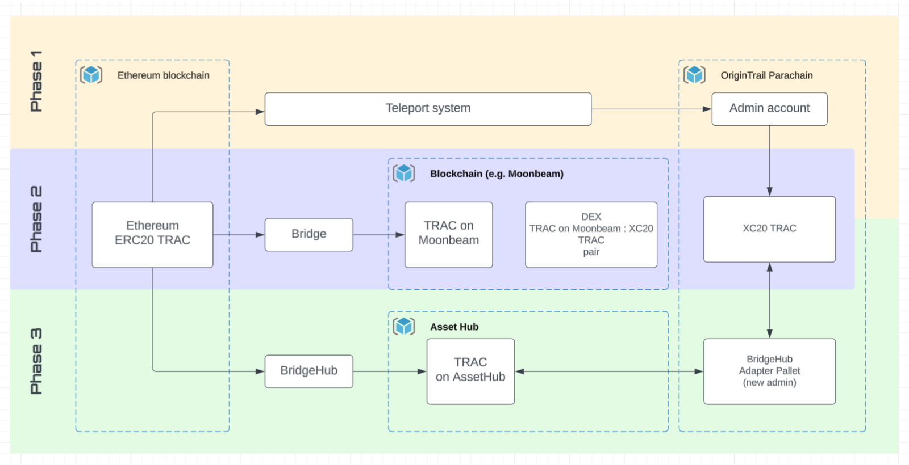

# OT-RFC-16 Parachain Bridges Implementation RFC

#### Authors: OriginTrail Core Developers
#### Document Status: Draft
####  Date: July 27th 2023

## Introduction

The OriginTrail ecosystem is a two-layer system, driving its two symbiotic networks by their respective crypto tokens - the OriginTrail Decentralized Network (hosting the multichain OriginTrail DKG, as indicated in the [whitepaper](https://origintrail.io/ecosystem/whitepaper) 2.0) driven by its utility token TRAC, and the underlying blockchains with their respective native tokens used for transactions. 

The OriginTrail Decentralized Network utility enabled by the TRAC token therefore requires each of the respective blockchains to support the TRAC token according to the TRAC tokenomics design, and requires necessary bridge infrastructure between relevant chains.

TRAC being an ERC20 token on Ethereum has been so far successfully bridged to two blockchains - Gnosis chain (formerly xDAI) and Polygon with their respective bridge infrastructure. 

With the launch of the dedicated OriginTrail blockchain on Polkadot - the OriginTrail Parachain - the required bridge infrastructure had to be established to enable the functioning of the OriginTrail DKG operation. The initial approach of bridging TRAC tokens to OriginTrail Parachain has been carried out with a successful Teleport process, bringing 100MM TRAC from Ethereum to OriginTrail Parachain. Details of the teleport process were established through several iterations and specified in [OT-RFC-12](https://github.com/OriginTrail/OT-RFC-repository/blob/main/RFCs/OT-RFC-12%20OriginTrail%20Parachain%20TRAC%20bridges%20(v2).pdf).

The same RFC-12 also outlined a path towards a decentralized bridge which has been in plans between Polkadot and Ethereum. Since the expected infrastructure is not yet fully instantiated, the purpose of this RFC is to provide a proposal for an updated framework for OriginTrail Parachain Bridges implementation that is immediately actionable and to collect relevant feedback from the OriginTrail community.

## Key principles

Since bridging assets across blockchain ecosystems is a topic with many moving parts, there are a few key principles that should be considered when assessing the viability of different approaches: 

* **Neutrality**
    * **Multi-bridge support** - the proposed framework should support multiple bridges to connect OriginTrail Parachain and Ethereum in order to reflect the current developments in the industry as well as limit reliance on any single technology.
    * **No cross-bridge security exposure**- the framework must not allow a design in which one bridge activity could compromise the security or functioning of another bridge. Impact of security incidents of any specific bridge on the entire OriginTrail ecosystem should be minimized as much as possible. 
    * **The OriginTrail Parachain TRAC token implementation should be trust minimized**- The current implemented XC20 bridged TRAC token on OriginTrail Parachain must be controlled by an on-chain entity (smart contract, pallet), with a clearly auditable open source implementation, minimizing any potential security issues. 
* **Inclusivity**
    * Anyone obtaining TRAC on Ethereum should be able to use the bridge infrastructure to bring it to OriginTrail Parachain to be used for the DKG functionality.
    * Bridging TRAC to other Polkadot Parachains seeking to utilize TRAC within their ecosystem should be possible, with recommendation of reuse of common Polkadot ecosystem infrastructure
* **Usability**
    * The user experience should be reasonably straightforward, using the current state-of-the-art tools and approaches.
    * There should be no limitations on the amount of TRAC tokens bridged to and from OriginTrail Parachain

## Proposed approach

In order to provide an immediately usable implementation, with the above principles in mind the core developers propose a 3 phase approach. The phases overlap to some extent (indicated in the scheme presented below). With the latest developments on OriginTrail Parachain (as of writing of this RFC), which include XCM enablement, Governance implementation and sudo removal, many integrations with Polkadot ecosystem tools have become available. The proposed approach below however is indicative of the principles, not exact projects (bridges, parachains), to be applied, to be in accordance with the neutrality and inclusivity principles. As the ecosystem further develops, we hope to see many competing approaches positively contributing to infrastructure and overall system usability.

### Phase 1: Teleport system reestablishment

The goal of this phase is to enable safe movement of TRAC tokens between OriginTrail Parachain and Ethereum, while implementations of additional bridges are taking place. The proposed teleportation system would follow the same principles as previously instated, utilizing the same tools, with the addition of establishing a two way approach. 

Any TRAC being teleported back to Ethereum would be unlocked from the appropriate smart contracts while being “burned” on the OriginTrail Parachain XC20 TRAC Asset pallet to maintain consistency. Given the cumbersome nature of the teleportation system, the frequency of execution will be **set to once a month.** Furthermore, due to the complexities involved the intention is to phase out the teleportation system as soon as possible.

**ETA for start of Phase 1: October 1, 2023**

### Phase 2: Integrating available Polkadot bridges

In parallel with Phase 1 execution, the intention is to immediately enable available Polkadot bridges to further improve user experience (users would be able to bridge at any time, not waiting a month to teleport). The integration efforts are already underway with several Polkadot teams, most notably within the Moonbeam ecosystem which has shown a high level of maturity and adoption. Phase 2 starts with opening up XCM integration channels between OriginTrail Parachain and Moonbeam, and we expect to continue with similar integrations if proposals of that kind are formulated in extension to this RFC. With the Governance system established on OriginTrail Parachain we encourage all interested stakeholders to propose their bridge integration.

However to make sure the above indicated principles are taken into account, a specific system of bridging is required. As presented on the diagram, a bridged token coming from Ethereum through a specific bridge will instantiate a bridge specific version of the TRAC token on that “intermediary” parachain. To ensure security across different bridge implementations, a market mechanism (such as a DEX) needs to be introduced in order to be able to obtain the OriginTrail Parachain XC20 TRAC token, which additionally needs to be bridged to the intermediary parachain. In case of any security incidents on the bridge (e.g. hacker obtaining the ability to mint bridged TRAC), this mechanism ensures safety of the OriginTrail Parachain XC20 TRAC (and therefore ERC20 TRAC on Ethereum) by enabling the market to adjust accordingly which will reflect in the value of the hacked bridge version of the token. By the same principle, in case of any security incident on the XC20 OT Parachain TRAC token, the bridged token version will not be exposed (as well as ERC20 TRAC on Ethereum, as teleporting will not be executed until the security incident is properly addressed).

It is implied that users of a bridge understand the security considerations of that particular bridge and its surrounding ecosystem, and therefore it is key to enable multiple different systems of choice for all users. Additionally, it is important to note that phase 2 overlaps with phase 1, allowing users to opt-out of using bridges entirely, and choosing to rely on the (phase 1) teleportation system.

 \
Phase 2 introduces a UX improvement over the Phase 1 teleportation system, however still implies multiple steps to bridge TRAC from Ethereum, which is to be addressed in Phase 3.

### Phase 3: Integrating Polkadot common good bridges

In accordance with discussions from OT-RFC-12 and Polkadot ecosystem developments, a common good parachain named BridgeHub (formerly known as Snowbridge) is to be deployed as a core ecosystem component of Polkadot. Given Bridgehub being a parachain, it is secured by the same mechanism as any other Polkadot Parachain (relaychain validators), sharing the exact same security considerations as OriginTrail Parachain itself. Therefore, with Phase 3 and integration with BridgeHub, the teleport system will be completely phased out, which includes transferring the admin capabilities of XC20 TRAC asset implementation to a specific **Bridgehub adapter account** which will become the administrative account. The BridgeHub adapter will perform the functionality of direct 1-1 conversion between the TRAC bridged from Ethereum through BridgeHub and the XC20 TRAC tokens on the OriginTrail Parachain. The system will imply a similar scheme as WETH applies to ETH on the Ethereum blockchain (locking TRAC received from BridgeHub and minting XC20 TRAC on OriginTrail Parachain, to maintain consistency).

As part of phase 3, we envision to further enhance the user experience by providing an easy bridging UI that will perform the bridging and conversion of TRAC to the XC20 TRAC usable in the DKG.

Phasing out the teleport system will also follow a TRAC teleport reconciliation process, by bridging all the teleported TRAC tokens (locked on Ethereum in teleport smart contracts) through BridgeHub to establish a 1-1 relationship between XC20 TRAC and BridgeHub TRAC. After all teleported TRAC from Ethereum side is locked in BridgeHub smart contracts, the BridgeHub adapter will be initialized and enable 1-1 conversions in both directions.

## Conclusion

As the OriginTrail ecosystem evolves, the proposed framework remains open to further development and refinements, with the anticipation of diverse approaches positively contributing to overall system usability. We now invite the OriginTrail community to actively participate and provide feedback on the proposed approach and principles. Your valuable insights will play a crucial role in shaping a robust and interconnected ecosystem.
