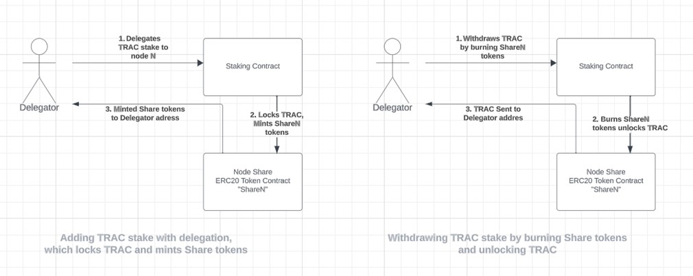

# OT-RFC-18 - Growing the Trusted Knowledge Foundation: TRAC delegation & OTP incentives

**Authors:** OriginTrail Core Developers

**Date:** August 31st 2023

_“Q. How do you propose to do this?_

_A. **By saving the knowledge of the race**. The sum of human knowing is beyond any one man; any thousand men. With the destruction of our social fabric, science will be broken into a million pieces. Individuals will know much of the exceedingly tiny facets of which there is to know. They will be helpless and useless by themselves. The bits of lore, meaningless, will not be passed on. They will be lost through the generations. **But, if we now prepare a giant summary of all knowledge, it will never be lost**. Coming generations will build on it, and will not have to rediscover it for themselves. One millennium will do the work of thirty thousand.”_

Hari Seldon

**Foundation series by Isaac Asimov (1951)**

## Introduction

OriginTrail ecosystem’s vision is to build a trusted knowledge foundation that greatly improves the way humanity’s knowledge is produced, maintained and shared in a trusted and inclusive manner. The purpose of the OriginTrail Parachain is to provide a tailored blockchain for Trusted Artificial Intelligence that extends the capabilities of the Decentralized Knowledge Graph (DKG) with growth incentives for [real-world adoption](https://origintrail.io).  

The requirements have already been met for the OriginTrail Parachain utility token (OTP) to be transferable via both centralized and decentralized exchanges (CEXs and DEXs) by having the decentralized governance in place. Now this DKG-focused L1 blockchain supporting real-world adoption, is set to drive growth of both valuable Knowledge Asset assemblies and DKG multichain infrastructure - **crucial components of the Trusted Knowledge Foundation**. It achieves that by incentivizing Knowledge generation and trusted knowledge infrastructure operation with OTP tokens, in unison with the multichain DKG adoption (detailed in OT-RFC-17). 

The OT-RFC-18 proposes the first batch of incentivization features, which also leverage already implemented OriginTrail Parachain community voting.

## OTP incentives for Trusted Knowledge Foundation Growth

Using OTP to create incentives for Trusted Knowledge Foundation Growth is one of its core utilities. The pool of OTP designated for that was 14% (or 70 million OTP) of the Genesis supply and also receives 30% of the annual inflation (you can learn more about the tokenomics and exact numbers [here](https://origintrail.io/documents/OriginTrail_Ecosystem_White_Paper_2.0.pdf)).

When considering the best first activities to be included for the OTP incentives, the key requirements include the **relevance** of the activity, **measurable nature** of the activity and **inclusiveness** for all OriginTrail participants. All OTP incentives should also take full advantage of OriginTrail Parachain Governance - from proposal stage for an activity, to ongoing decisions on the scope of incentivisation support or even proposals to discontinue/substitute the incentives with more appropriate ones.

The OT-RFC-18 takes the above guidelines in action to propose 2 categories of activities as candidates for incentivization - **(1) Incentivizing trusted knowledge creation** and **(2) Incentivizing trusted infrastructure**.

## Incentivizing trusted knowledge creation

Incentivizing the creation of trusted knowledge **is central to the growth of the OriginTrail** Trusted Knowledge Foundation. By offering OTP incentives for Knowledge Asset creation the “north star” growth activity is supported. The intention of incentives is also to serve as a curation mechanism for guiding publishing of high quality knowledge on the DKG. Curation is to be implemented through community-wide decisions using OriginTrail Parachain Governance. These activities will provide a significant boost towards creating truthful, structured, and AI-ready Knowledge Assets - ultimately leading to the creation of the **largest trusted knowledge foundation** in the world. The specific incentive mechanisms to achieve this will be continuously improved through OriginTrail Parachain Governance proposals.

## Incentivizing trusted infrastructure: TRAC delegation & Multichain adoption

The OriginTrail trusted infrastructure is a two layer system with two tokens:

* the **DKG layer** hosted on the OriginTrail Decentralized Network (ODN) fueled by the TRAC utility token, 
* and **multi-chain consensus layer**, with respective native blockchain tokens in use (which includes the OriginTrail Parachain and OTP token).

Each of the layers performs a distinct function, yet are necessary building blocks for the implementation of the DKG (more info available in the OriginTrail whitepaper 2.0). 

An increasingly important element of the trusted knowledge infrastructure is the TRAC stake for DKG nodes. The stake presents a collateral TRAC amount that is locked-up as a signal for the security and quality of node operations. The amount of TRAC stake also significantly contributes to the share of the network rewards (paid as network fees by Knowledge Asset publishers) that a DKG node can receive. 

With the OT-RFC-18, the TRAC delegation feature is introduced, and DKG node operators will now be able to open their node stake for other TRAC holders to participate. With a higher amount of TRAC as their stake, nodes are eligible for more network rewards which are then shared with those that delegated their TRAC (implementation details below). This instrument will lead to more TRAC being used for its utility, larger TRAC holder community engagement, more robust and secure trusted knowledge infrastructure and a vibrant “marketplace” of DKG nodes and TRAC delegators. 

To incentivize all of the above-mentioned positive effects of TRAC delegations, the **OT-RFC-18 proposes this feature to be eligible for OTP incentives as well.** The core premise of the OTP incentives would be to allow any TRAC delegator on blockchains where DKG V6 is implemented to be eligible for OTP rewards according to the size of their delegated stake.  

Moreover, as more blockchain ecosystems [express interest](https://medium.com/origintrail/ot-rfc-17-origintrail-integration-with-evm-compatible-blockchains-e635dc8afb86) to integrate with the DKG (following [the procedure and criteria detailed in the OT-RFC-17](https://github.com/OriginTrail/OT-RFC-repository/tree/main/RFCs/OT-RFC-17-OriginTrail-integration-with-EVM-compatible-blockchains)), one time incentives in OTP are proposed, to both reward TRAC token holders who support integrations by contributing to the minimum required threshold. More details on this to be discussed in a separate proposal on incentivising MultiChain DKG adoption before voting on it via OriginTrial Parachain governance mechanism.

### TRAC delegation mechanics

The implementation of the TRAC token delegation mechanism is loosely based on DeFi projects such as Uniswap, with the core component representing **Node share tokens**, (similar to Uniswap LP tokens). Each node deployed on ODN has a respective, node-specific, mintable and burnable 18 decimal ERC20 token created for it on the desired blockchain during node deployment, with the token symbol and name set by the node operator, as can be seen in the figure below. 

_Figure 1: Node share tokens on OriginTrail Parachain, visible through Subscan block explorer_

The “share tokens” represent essentially a share of the total amount of TRAC stake that has been deployed on a specific node. The TRAC delegation feature, when fully activated, will enable node operators to “open up” their node to receiving more TRAC stake through delegation by TRAC token holders. The delegation mechanism is explained in the following figures:

**Formula for share tokens minting:**

Where _tracAmount_ is the amount of TRAC delegated to the node.

**Formula for share tokens burning:**

Where _tracAmount_ is the amount of TRAC withdrawn from the node stake.

Nodes with larger amounts of TRAC staked have effectively stronger economic security signals (see [the whitepaper](https://origintrail.io/documents/OriginTrail_Ecosystem_White_Paper_2.0.pdf)), and therefore an advantage in receiving Knowledge Asset publishing fees from Knowledge Publishers (also in TRAC). Therefore, node operators have an interest in attracting a large amount of TRAC stake to establish a better position in the DKG service market. 

TRAC token holders’ interest is in putting their TRAC tokens to work, which is achieved by node operators effectively sharing a portion of the TRAC fees received through Knowledge Asset publishing with the delegators. 

Effectively, node runners are delegators to their own nodes at the moment of writing this RFC (currently only node admin keys can delegate, until the fully fledged system is implemented), and get 100% of the TRAC rewards from publishings their nodes receive.

When the delegation feature goes live, each node operator will be free to set their node settings, which are the following:

* _operator_fee_: percentage of the TRAC fee, which is deducted from each knowledge asset publishing fee, and is directed to the node operator prior to sharing with other delegators. The remaining TRAC fee is then split in proportion to the amount of share tokens among all delegators,
* _maximum_delegated_trac_: the maximum amount of stake a node operator allows to be present on their node.

It is important to note that the system is non-custodial, meaning that all delegated TRAC is locked in DKG core contracts, and can only be “withdrawn” from the system by burning share tokens by the delegators, which can only be performed by the [DKG Staking contract](https://github.com/OriginTrail/dkg-evm-module/blob/main/contracts/Staking.sol).

With such a system in effect, TRAC token holders can safely delegate their tokens to node runners. Having Node Share tokens be ERC20 tokens, they can also be easily transferred between wallets (e.g. a delegator can change wallets for OpSec purposes by transferring share tokens to a different address) and utilized with any ERC20 supporting tool.

Finally, the proposal indicates delegating TRAC in two ways:
* **“Delegate” function**: by using this function, share tokens are available to the delegator, enabling withdrawing TRAC at all times. This function should not involveOTP incentives,
* **“Delegate & Lock” function**: share tokens are locked in DKG contracts for a period of time, which qualifies the delegator for OTP Incentives, as they promote long-term security in the network.

 
## TRAC Delegation: Implementation action points

After the RFC process and open discussion on TRAC delegation feature is completed, the core development team will proceed with detailed specification and updates on the implementation. Community proposals through comments on this RFC are very welcome. 

The relevant updates are expected to include an updated version of smart contracts, with the aim to encapsulate other optimizations to the system (system formulas, neighborhood distance function updates, etc). All information will be available in the relevant Github repositories. 

## Conclusion

This RFC introduces the implementation direction for OTP incentives and initial high-impact activities for the growth of the Trusted Knowledge Foundation. OriginTrail Core Developers invite the wider community to provide their comments and participate in the iterative design of the system. #traceon
