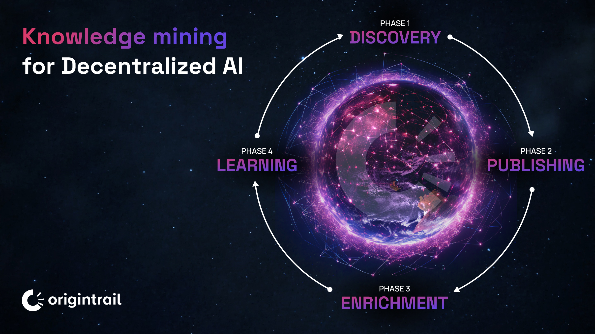

# OT-RFC-20 - Knowledge Mining for Decentralized AI 

**Authors:** OriginTrail Core Developers

**Date:** December 7th 2023

_"The way you train that (AI) system will have to be crowdsourced ... if you want it to be a repository of all human knowledge, all humans need to contribute to it." - Yann LeCun_

OriginTrail is an open decentralized knowledge system of collectively ownable, discoverable and verifiable units of knowledge, connected in a Decentralized Knowledge Graph, safeguarded by several blockchains. World class companies are already using OriginTrail to create value for their ecosystems. For example, OriginTrail is enabling frictionless international trade for over 40% of US imports by fostering secure exchange of security audits. With the Metcalfe phase initiated in November, the OriginTrail ecosystem entered a journey to achieve  a 100.000x growth of the verifiable web of knowledge, pursued in two stages - the genesis, and convergence. The genesis phase creates opportunities for organizations and individuals who will mine the most valuable Knowledge Assets using the latest advancements on the AI-specific layer 1 blockchain - the OriginTrail Parachain (on Polkadot), which will evolve into NeuroWeb.

This RFC introduces knowledge growth incentives through a key innovation - **Knowledge Mining**, a decentralized way of growing the trusted knowledge base for humanity, and defines the scope of the beta Knowledge Mining program. The beta program is supported by the [EU’s Next Generation Internet initiative - NGI Search](https://www.ngisearch.eu/view/Events/OC1Searchers) through the ChatDKG project. In addition to that Trace Labs (OriginTrail Core Developers) have provided support through the [ChatDKG Grant program](https://chatdkg.ai/) aimed for builders of Decentralized AI tools and integrations with the DKG, which are to be piloted in the Knowledge Mining beta program.

_This project has received funding from the European Union’s Horizon Europe research and innovation programme via the NGI Search [grant agreement 101069364](https://urldefense.com/v3/__https://cordis.europa.eu/project/id/101069364__;!!D9dNQwwGXtA!W2TymOXKZfJknzduXKZepycFGpQKHCYE2taARqr71Z_4hUad5Z9nJ1iA0WXSsznErIrWwkS6l5ttaifbtFcALg$) and linked with the [Next Generation Internet Initiative](https://urldefense.com/v3/__https://ngi.eu__;!!D9dNQwwGXtA!W2TymOXKZfJknzduXKZepycFGpQKHCYE2taARqr71Z_4hUad5Z9nJ1iA0WXSsznErIrWwkS6l5ttaifkmkhTvg$)._

This RFC is used as information support for the upcoming referendum on OriginTrail Parachain on Polkadot seeking to:
* Confirm the Knowledge Mining mechanics
* Introduce the new naming for OriginTrail Parachain (token ticker OTP) to reflect its unique value proposition as an enabler for the verifiable web through decentralized Artificial Intelligence, becoming **NeuroWeb (token ticker NEURO)***

\* No new token is being created, OTP tokens become Neuro tokens

## Decentralized global intelligence: Synergy of blockchains and Decentralized Knowledge Graph

_“The word synergy comes from the Greek sin-ergo, meaning, to work together. It describes a mutually supportive atmosphere of trust, where each individual element works towards its own goals, and where the goals may be quite varied; nevertheless, because all elements of a synergetic system support one another, they also support the whole.”_ - Buckminster Fuller

The breakthrough of creating a decentralized global intelligence is underpinned by driving both vertical and horizontal synergies that enable network effects. 

**Vertical synergies**

OriginTrail forms a strong synergy between knowledge graphs and blockchains. The result of that synergy is a Decentralized Knowledge Graph (DKG) integrated with multiple blockchain networks. Each vertical integration of the DKG to a blockchain network not only brings additional resilience and scale to the OriginTrail DKG, but also enriches that blockchain with native DKG capabilities. 

**Horizontal synergies**

Building a cross-chain knowledge base enables horizontal synergies between various blockchain ecosystems. With the proposed knowledge mining design, knowledge miners can mine new knowledge on any of the DKG integrated blockchains and be eligible for claiming their rewards on NeuroWeb. Due to DKG design, all knowledge published on one blockchain can be accessed on any other integrated blockchain, allowing synergy of knowledge assets across chains. 

## Knowledge Mining

Data can be an extremely valuable resource, when turned into highly structured, contextualized knowledge. We’ve seen this materialize in many systems from AI models to knowledge graphs driving insights for big corporations (Google, Amazon, Netflix, IKEA, Uber - to name a few), effectively proving the inherent value of knowledge. 

OriginTrail aims to create the largest public knowledge base in the world, by doing so in a collaborative, crowdsourcing approach, via a unique approach called **Knowledge Mining**.

Knowledge Mining is the process of producing high quality, blockchain tracked knowledge for artificial intelligence, pioneered by the OriginTrail ecosystem. This cyclical process leverages the key component of the OriginTrail technology - Knowledge Assets - which are ownable containers for knowledge with inherent discoverability, connectivity and data provenance. 

Similarly to the concept of Bitcoin mining, where miners collectively provide computing resources to the network and receive incentives in coins, knowledge miners contributing useful knowledge to the OriginTrail DKG will receive NEURO tokens (currently OTP). With Knowledge Mining incentives enabled across multiple blockchains, the ambition is to drive exponential growth of trusted knowledge in the OriginTrail Decentralized Knowledge Graph.

There are 4 general steps in the Knowledge Mining cycle:
1. **Discovery** - during which contributors discover profitable "gaps" in knowledge in the DKG, signaled by knowledge consuming applications
2. **Publishing** - once a gap is identified, knowledge miners create and publish a set of Knowledge Assets in the DKG. The aim is to incentivise high quality Knowledge Assets (based on content, structure, usage signal and other quality criteria)
3. **Enrichment** - participants can collectively improve existing knowledge by by various enrichment activities, such as connecting Knowledge Assets to existing high quality Knowledge Assets (e.g. providing linking signal via [UALs](https://docs.origintrail.io/decentralized-knowledge-graph-layer-2/dkg-basic-concepts#what-is-a-ual)), providing economic signal (e.g. via knowledge market purchase activity, direct economic stake on specific Knowledge Assets, etc) and usage signal (e.g. by utilizing specific knowledge, indicating its usefulness)
4. **Learning** - the system finally "learns" from the previous steps in several ways, including DKG entity relevance updates (e.g. equivalent to PageRank), such as reasoning based on newly available knowledge, repopulating vector stores and training AI models based on the newly acquired knowledge.

Knowledge miners publish to the DKG by spending TRAC tokens, utilizing the underlying blockchain native token for gas fees (e.g. NEURO/OTP on NeuroWeb/OriginTrail Parachain, xDAI on Gnosis, ETH on Ethereum etc), while receiving Neuro tokens based on the level of their contribution, regardless of their blockchain of choice to perform Knowledge Mining.

NEURO token incentives will be distributed to knowledge miners based on both the quality and quantity of their contributions, regardless of the blockchain they choose for Knowledge Mining. It's important to note that this mechanism is designed to evolve alongside the development of Knowledge Mining. As the ecosystem grows adjustments will be made to further improve fairness and efficiency of the reward system until the system matures. This dynamic approach ensures that participants are continually incentivized and rewarded for their valuable contributions. The process of Knowledge Mining implementation is subject to updates guided by the decentralized governance system on NeuroWeb (governance details available in [OT-RFC-15](https://github.com/OriginTrail/OT-RFC-repository/tree/main/RFCs/OT-RFC-15-OriginTrail-Parachain-Governance)). 

To kickstart the first Knowledge Mining system and validate the approaches, **we are introducing the Genesis Knowledge Mining beta program**.

## Genesis Knowledge Mining beta program

The initial beta program is aimed at kickstarting Knowledge Mining through a Supervised Knowledge Mining approach as part of the Metcalfe Genesis phase of the OriginTrail roadmap. To establish dynamic cycles and quick iterations, the initial beta Knowledge Mining program will be executed as described below.

### Mechanics of the beta Mining program {#mechanics-of-the-beta-mining-program}

The initial beta Knowledge Mining will be facilitated by OriginTrail Core developers and all interested knowledge miners can participate by using the **[Knowledge Mining Kit](https://github.com/OriginTrail/knowledge-mining-kit)**, containing a set of tools and tutorials on knowledge mining. The aim of the beta program is to validate the intended approach in a simplified manner (MVP approach) so that improvements and potential flaws can be discovered in a timely manner. The beta Knowledge Mining will be performed only on OriginTrail Parachain (NeuroWeb).

**Discovery:** To establish dynamic cycles and quick iterations, the genesis Knowledge Mining beta program will have a narrow focus on two specific knowledge domains:
1. Knowledge about the wider OriginTrail ecosystem (AI, knowledge graph and blockchain technologies, and their relation to OriginTrail)
2. Knowledge relevant for the construction industry

Details of how discovery can be done, and the specifics on the two knowledge domain topics will be presented in the Knowledge Mining kit.

**Publishing:** Several tools and instructions will be provided for creation and publishing of Knowledge Assets in the Knowledge Mining Kit, and will gradually expand over the course of the beta program. 

**Enrichment:** Will focus on connecting relevant Knowledge Assets (linking signal) and token locking (economic signal) \

**Learning:** Initially the learning step will be performed by OriginTrail Core developers, introducing mined Knowledge Assets into OriginTrail World.

All details of the process, including how you can participate will be explained in the Knowledge Mining Kit. A total of 1.000.000 OTP tokens (to become Neuro tokens) will be designated for the Knowledge Mining Beta program rewards.

## OriginTrail Parachain becomes NeuroWeb - the Knowledge Mining blockchain 

The OriginTrail Parchhain is poised for a transformative evolution into **NeuroWeb**, a blockchain platform specifically tailored for Knowledge Mining and Knowledge-centric functions. This shift represents an advanced stage in the evolution of the original concept behind OriginTrail Parachain and its OTP token (to be renamed to NEURO), a progression that will be thoroughly detailed in the  upcoming NeuroWeb whitepaper, detailing the **NEURO token** economic model designed to incentivize the growth and dissemination of knowledge.  

To ensure community involvement and support, **a Referendum vote is to be executed on the OriginTrail Parachain**. This critical step will not only confirm the community's support for the proposed change but also mark the beginning of the Knowledge Mining beta program. The community is invited to review this Request for Comments (RFC) and provide comments as  soon as possible, after which the referendum voting will take place. The referendum voting will kickstart on Monday, December 18th 2023.

Looking ahead, the Genesis Knowledge Mining beta program is set to commence in January 2024.

To conclude, the referendum vote will entail:
* Confirmation of the name change from OriginTrail Parachain to NeuroWeb
* Confirmation on the Knowledge Mining concept

## Conclusion

This RFC introduces the concept of Knowledge Mining and the dedicated artificial intelligence blockchain NeuroWeb which will implement Knowledge Mining capabilities in Web3. The wider community is invited to provide feedback on the presented proposals and participate in confirming the indicated direction in the coming referendum to be voted upon discussion on this RFC.

#TraceON
