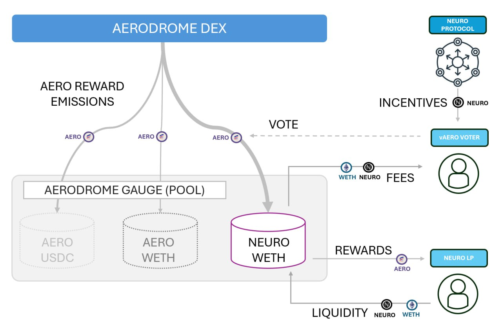

# Summary
A proposal for ID Theory (IDT) to create and run a NEURO/WETH liquidity incentivisation program on Base, via Aerodrome, and Stellaswap, via Moonbeam, using community treasury NEURO tokens. IDT is requesting that 2.2M NEURO be allocated to running and operating this 4-month incentive campaign.

# Background
IDT is one of the core operators of the first deployed Paranet, [SciGraph](https://medium.com/id-theory/scigraph-the-dawn-of-a-new-scientific-era-d067e293c6b2), which is focused on decentralised science research. The front-end deployment for SciGraph utilises the Base L2, allowing the paranet to combine Base’s userflow, dev tooling, wallet infrastructure and liquidity with the security, robustness and interoperability offered by Polkadot as a backend substrate.

This is a unique proof of concept for Polkadot-powered applications, allowing a new cadre of users who have yet to interact with Polkadot into the ecosystem, with ultimate value settling back to the foundational layer.

# Proposal
## Why Aerodrome?

Aerodrome Finance is the leading Automated Market Maker (AMM) designed to serve as the central liquidity hub on the Base network. Aerodrome’s token economy is a simplified version of Curve.fi; AERO can be vote-locked for veAERO, which can then be used through voting to direct weekly emissions to token pairs on a weekly cadence. External parties can choose to incentivise voters by adding token ‘incentives’ for specified pairs. Liquidity providers will earn AERO emissions, whilst veAERO voters earn the trading fees and incentives for each pair they vote for. Since inception, most epochs have operated with a positive incentive-multiplier, meaning that the dollar value of AERO emitted to pairs far outweighs the dollar value of the incentives deposited, generally meaning that Aerodrome is the most efficient method by which to bootstrap liquidity.

## Why Stellaswap?

Stellaswap is one of the leading decentralised exchanges on Moonbeam. It allows for “Ecosystem boosted pools”, utilising a simple asset mining reward for liquidity provision.

# Summary
A proposal for ID Theory (IDT) to create and run a NEURO/WETH liquidity incentivisation program on Base, via Aerodrome, and Stellaswap, via Moonbeam, using community treasury NEURO tokens. IDT is requesting that 2.2M NEURO be allocated to running and operating this 4-month incentive campaign.

# Background
IDT is one of the core operators of the first deployed Paranet, SciGraph, which is focused on decentralised science research. The front-end deployment for SciGraph utilises the Base L2, allowing the paranet to combine Base’s userflow, dev tooling, wallet infrastructure and liquidity with the security, robustness and interoperability offered by Polkadot as a backend substrate.

This is a unique proof of concept for Polkadot-powered applications, allowing a new cadre of users who have yet to interact with Polkadot into the ecosystem, with ultimate value settling back to the foundational layer.

# Proposal
## Why Aerodrome?
Aerodrome Finance is the leading Automated Market Maker (AMM) designed to serve as the central liquidity hub on the Base network. Aerodrome’s token economy is a simplified version of Curve.fi; AERO can be vote-locked for veAERO, which can then be used through voting to direct weekly emissions to token pairs on a weekly cadence. External parties can choose to incentivise voters by adding token ‘incentives’ for specified pairs. Liquidity providers will earn AERO emissions, whilst veAERO voters earn the trading fees and incentives for each pair they vote for. Since inception, most epochs have operated with a positive incentive-multiplier, meaning that the dollar value of AERO emitted to pairs far outweighs the dollar value of the incentives deposited, generally meaning that Aerodrome is the most efficient method by which to bootstrap liquidity.

## Why Stellaswap?

Stellaswap is one of the leading decentralised exchanges on Moonbeam. It allows for “Ecosystem boosted pools”, utilising a simple asset mining reward for liquidity provision.

# Goals
- **Enable access to the Neuroweb ecosystem.** It is currently difficult to obtain NEURO to participate in the ecosystem; centralised exchanges such as MEXC hold less than $10 of depth and presence on decentralised exchanges is minimal.
- **Facilitate the Scigraph Economy.** Both TRAC and NEURO need to be available within front-end venues (in this case, Base) to close the economic loop for continuous data publishing.
- **Drive Network Effects.** The presence and distribution of NEURO in one of the fastest-growing venues engages a new cohort of users, effectively bringing new eyes to the project, particularly with the recent growth of DeSci and the co-location of DeSci projects on Base.
- **Kickstart Sustainable Growth.** Growing liquidity sustainably should result in greater volume, which in turn generates more fees, eventually allowing the program to operate independently of incentives.
- **Increase token utility.** Incentivised pools create additional opportunities for NEURO holders to earn yield on their holdings.
- **Efficient use of incentives.** Protocol incentive provision on Aerodrome currently has a delta of 2.5x to Aero emitted to pools, meaning $2.50 is rewarded to LPs for every $1 spent on an incentivised pool.

# Implementation
- **Treasury.** There will be an eventual 65m NEURO in the community treasury. 20m is currently available.
- **Allocation.** IDT are requesting 2.2m NEURO for an initial four-month Liquidity Programme. 1.96m NEURO is allocated to Aerodrome, 240k NEURO to Stellaswap.
- **Incentives Management.** IDT will be appointed Base Incentives Manager, with NEURO incentives stored and managed via Safe Multi-signature wallet. The Base Incentives Manager will be responsible for liaising with the Aerodrome team, assessing weekly deposits alongside Aerodrome guidelines (such as TVL and Volume limits) and depositing incentives into Aerodrome contracts. A party with associated experience in Moonbeam liquidity products will be nominated Moonbeam Incentives Manager, with incentives withheld until such a party is nominated and accepted.
- **Program Length.** The trial program will last four months. Price fluctuations in either NEURO or ETH will affect the liquidity incentives plan; the Incentives Manager should manage resources appropriately in order to maintain a sustainable level of TVL over the course of the programme. Aerodrome has limits on incentives versus pool depth, which will determine the maximum amount of NEURO that can be deposited each epoch. The programme should not extend beyond four months without Governance approval, regardless of remaining assets, at which time any remaining assets will be returned to the treasury.

# Stakeholders
- **NEURO Holders.** Can provide NEURO and WETH liquidity to Aerodrome and earn AERO, or provide NEURO AND ETH liquidity to Stellaswap and earn NEURO.
- **Paranet Participants.** Are able to obtain or dispose of NEURO with acceptable slippage.
- **veAERO Voters.** Can earn NEURO by voting for the NEURO/WETH pair.
- **Neuroweb DAO.** Enablement of Neuroweb token economy, increased userflow and visibility of the project.

# Conclusion
This proposal marks a significant and timely opportunity for the Neuroweb community, laying the foundation for growth, user acquisition and an expanded presence in the Base ecosystem, and aligned ourselves with core DeSci protocols. Incentivising a NEURO-WETH pool on Aerodrome allows us to kickstart the Paranet economies, whilst generating significant beneficial secondary effects, whilst incentivising a pool on Stellaswap allows for the token economy to grow on Moonbeam.
