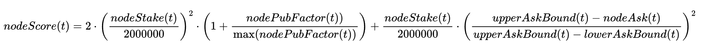
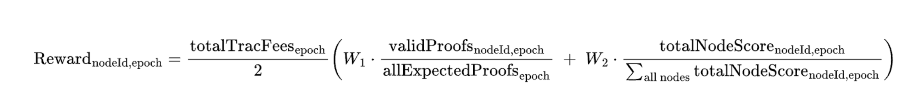

# OT-RFC-24 DKG V8 Random sampling proof system** 

**Authors: OriginTrail Core Developers**

**Date:** Apr 3, 2025

Table of contents

[Introduction](#introduction)

[Problem definition](#problem-definition)

[Functional Requirements (FRs)](#functional-requirements-\(frs\))

[Non-Functional Requirements (NFRs)](#non-functional-requirements-\(nfrs\))

[Solution: Random sampling, a scalable proof-of-knowledge-based system](#solution:-random-sampling,-a-scalable-proof-of-knowledge-based-system)

[Proof system sequence](#proof-system-sequence)

[System performance](#system-performance)

[Pre-V8.1  random sampling reward distribution](#pre-v8.1-random-sampling-reward-distribution)

[Rollout plan](#rollout-plan)

[Conclusion](#conclusion)

# Introduction {#introduction}

This RFC aims to introduce a scalable knowledge availability proof system in the OriginTrail Decentralized Knowledge Graph (DKG) V8. As knowledge publishers populate and grow the DKG by minting Knowledge Assets on the public DKG network, the **DKG Core Nodes are responsible** **for the continuous availability of the public DKG content, metadata, and provenance proofs of the DKG.** For providing a high-quality service, DKG Core Nodes compete based on multiple factors—high uptime, economic stake, publishing factor, and service ask requirements—and are incentivised through TRAC token network fees, funded by the knowledge publishers at publishing time.

As a decentralized system, the DKG network incentive system is completely handled by the DKG-smart-contract-based proof system, which requires periodic proof submissions from DKG Core Nodes to ensure the service availability and quality.

This RFC will detail the most advanced DKG proof system yet, called **random sampling**, which aims to ensure scalability and low cost for the entire system while maintaining strong availability guarantees.

# Problem definition {#problem-definition}

With the previous implementation of DKG V6, the network encountered practical scalability limitations due to its intensive block space utilization and high demands placed on DKG node resources. These constraints represented a bottleneck to achieving Internet-scale adoption, limiting the network's growth and the widespread usability.

DKG V8 aims to address these scalability challenges. DKG V8.0, released in December 2024, introduced the first scalability feature known as **batch minting**, which significantly increased the scalability by aggregating multiple minting operations into a single blockchain transaction, dramatically reducing the consumption of block space for knowledge publishing. As a result, batch minting immediately unlocked greater scalability and operational efficiency (at the time of writing this RFC, the DKG state has crossed a total of 530M knowledge assets hosted, jumping from \~10M in only 3 months),  enabling broader adoption without compromising decentralization or security.

Building on these advancements, the upcoming DKG V8.1 releases aim to further enhance the scalability and sustainability of the proof system. The core ambition of DKG V8.1 is to substantially **lower both block-space requirements** and **resource demands** **placed upon DKG Core Nodes**. By optimizing the underlying proof mechanisms through a random-sampling-proof-challenge scheme, V8.1 will maintain strong security guarantees while significantly increasing scalability. This new scheme, detailed further in this document, will facilitate higher throughput and broader node participation, ensuring that the OriginTrail DKG remains robust, accessible, and prepared to meet the evolving demands of global-scale decentralized knowledge sharing.

To properly address the above ambition for lower block space consumption and scalable node resource allocation, the following requirements have been identified:

## **Functional Requirements (FRs)** {#functional-requirements-(frs)}

* **FR1 Core Node scalability requirement:** DKG Core Nodes do not need to host the entire DKG in the long run, but rather store sectors of the DKG. A DKG Core Node may store 1 or more sectors.  
* **FR2 Trusted proof validation:** Enough data needed for challenge generation and proof verification should be available on chain, so that smart contracts can independently verify them based on DKG Core Node proof submissions.  
* **FR3 Safety requirement:** The DKG proof system should be sufficiently random, so that DKG Core Nodes cannot practically predict future challenges.  
* **FR4 TRAC Incentives favor positive network activity:** High uptime, high economic stake, high publishing ratio, and lower service ask are incentivized.  
* **FR5 Proof system agnostic to network topology:** The system is not dependent on Core Node hash ring position (as pre-V8).  
* **FR6 Real-time proof system:** The system should operate on the basis of the current DKG node state—current uptime, active stakes, publishing factors, service ask values (e.g., Core Nodes should not be able to “claim uptime” in the past).

## **Non-Functional Requirements (NFRs)** {#non-functional-requirements-(nfrs)}

1. **NFR1 The DKG proof system scalability requirement:** The proof system should scale up to at least 100B knowledge assets.  
2. **NFR2 Blockchain gas cost:** Total gas consumption per node, per day for all random sampling transactions should be under 100M gas .   
3. **NFR3 Core Node usability:** The random sampling system implementation should operate without necessary involvement from the node operator (the node operators are incentivized to focus on uptime, stake accrual, publishing, and managing node service ask, for the benefit of the entire network).  
4. **NFR4 Reward collection before V8.1:** Nodes should be able to collect accumulated rewards before the V8.1 release.

# Solution: Random sampling, a scalable proof-of-knowledge-based system {#solution:-random-sampling,-a-scalable-proof-of-knowledge-based-system}

Random sampling is one implementation of a “Proof of Knowledge” (PoK), used as a key feature of the DKG to implement incentives for nodes to store Knowledge Assets and have high uptime. 

To understand the proof system concept in more detail, we introduce a few important terms:

* **Knowledge sector:** In DKG V8, knowledge collections are organized into “sectors”—large “virtual repositories” of knowledge maintained by a set of DKG nodes and registered on 1 blockchain. Sectors were introduced to enable easier horizontal scaling and will be beneficial once DKG reaches several billions of Knowledge Assets in size (at the current time, there is only 1 active DKG sector per blockchain, so a total of 3 sectors). Each sector is hosted by a group of DKG Core Nodes, which constantly submit knowledge availability proofs to DKG smart contracts—1 proof per sector in a proof period. Once more sectors are introduced, it will be possible for DKG Core Nodes to host multiple sectors at the same time (ability to vertically scale one node, dependent, of course, on hardware resource availability).   
* **Knowledge collection:** A set of Knowledge Assets, materialized as an NFT collection on the blockchain, and a set of triples and named graph in the DKG node graph databases. All Knowledge Assets in one collection have the same life-time, measured in epochs.  
* **Knowledge chunk:** Each Knowledge Collection (KC) is split into 32-byte-sized “chunks”, from which a Merkle root hash is computed on publishing. DKG Core Nodes verify this hash every time they receive newly published data by recomputing it and confirming a match with the Knowledge Collection on-chain Merkle root.   
* **Epoch:** Used to measure Knowledge Collection lifetime. For example, 1 knowledge collection can live for 12 epochs, roughly equivalent to 1 year. One epoch is set at 30 days.  
* **Proof period**: A short period of time (measured in minutes) in which a node is expected to submit a proof of knowledge via the random sampling system.

## **Proof system sequence** {#proof-system-sequence}

1. A DKG Core Node periodically interacts with the proof system. Every ***proofPeriod***, a challenge is generated by the DKG smart contract, which randomly selects a KC chunk for the node to prove from 1 sector. Challenges are unique for each node. The challenge is presented as two valid random numbers—***KCID*** (a knowledge collection ID) and ***CN*** (chunk number). A valid random number is considered a number in the possible range (existing and non-expired KC, valid chunk number).

challenge(nodeId, t) \= ( random(KnowledgeCollectionIDactive), random(chunkNumberKCID) 

2. Once the challenge has been generated on chain, DKG Core Nodes compute a Proof of Knowledge (the correct Merkle proof for the challenged **KCID** and **CN**)  and submit it to the proof system smart contracts. The proof consists of the requested chunk data and corresponding Merkle proof for that Knowledge Collection.  
3. If the sent proof of knowledge can be used to reproduce the correct Merkle root in the smart contracts (submitted and validated on publishing), the proof is considered valid and a **proofScore** is computed as a function of total node stake, ask, and publishing factor at time of proof submission (as in the tokenomics formula). The indicative formula is  
   *score= f(uptime, nodeStake, nodePublishingFactor,nodeAsk)*

   If, for whatever reason, a node “misses” to submit a valid proof during the *proofPeriod*, *proofScore* \= 0 for that *proofPeriod.*  
4. As proofs are submitted during the epoch duration, a ***totalNodescore(node\_id**)* is computed as the sum of all individual *proofScores totalNodeScorenodeId \= ∑* **proofScore, for all proof scores**   
5. Once an epoch is completed, the appropriate amount of rewards is unlocked for all the delegators (proportional to their stake delegation)and node runers based on the node’s individual *totalNodeScore* for that epoch. 

The individual nodeScore formula is:

All individual scores (per proof) are then accumulated

totalNodeScorenodeId,epoch= ∑ nodeScore(t), over the time of one epoch.

The total amount of TRAC fees (accumulated from publishing) in one epoch is then divided across all nodes by the following formula:

Each delegator (and node runner) is then eligible for their share of node rewards, according to their stake contribution, over a period of time during their stake availability in that epoch (*stakingPeriod*). The *nodeScore* (and therefore *delegatorScore*) is calculated on an ongoing basis per proof submission, while *totaTracFees* is accumulated over the epoch duration. This prevents the possibility that a delegator could stake at the end of an epoch, and claim rewards for the entire epoch (“free riding”).

Given the DKG hosts over 500M+ Knowledge Assets at the moment (est. 5B+ chunks), the probability of a chunk selection is 2\-10 , which will further diminish with the growth of the DKG, making these challenges “harder” over time as nodes need to maintain larger amounts of knowledge in a sector.

With this approach, all of the above functional requirements are satisfied:

* **FR1 The DKG proof system scalability requirement: satisfied (no impediments)**  
* **FR2 Core Node scalability requirement: satisfied (no impediments)**  
* **FR3 Simplified system-wide time management: satisfied**  
* **FR4 Trusted proof validation: satisfied**  
* **FR5 Safety requirement: satisfied**  
* **FR6 TRAC incentives favor positive network activity: satisfied**  
* **FR7 Proof system agnostic to network topology: satisfied**  
* **FR8 Real-time proof system: satisfied**

## **System performance** {#system-performance}

The above system is designed to be a lightweight addition to the existing DKG Core Node operations, ensuring that nodes are not burdened with significant additional computational and operational overhead. Proof generation and submission are streamlined, with most of the heavy lifting handled off-chain, yet not overloading the nodes too frequently, allowing them to focus on uptime, stake accrual, publishing, and service optimization. 

The intention is also to maintain low gas costs for proof submission per node, keeping on-chain interactions economically feasible for all participants. With the proof system optimized for minimal blockchain resource usage, the focus of future scalability efforts will shift toward scaling the graph database layer itself. This includes ongoing integrations with projects such as Amazon Neptune, as well as continued improvements to the performance and capacity of Blazegraph, ensuring the DKG infrastructure can support massive growth in Knowledge Assets and maintain high throughput for querying and publishing. Several intermediate releases are already underway, which will prepare the DKG for the random sampling system rollout. 

The initial proof period will start from 1 proof every 30 minutes, with the intention to lower the time to strengthen the availability requirements over the course of the DKG lifetime.  The nodes will maintain a robust proof submission system, attempting to submit proofs multiple times. The overall implementation is expected to be tuned with [OT-RFC-21](https://github.com/OriginTrail/OT-RFC-repository/blob/main/RFCs/OT-RFC-21_Collective_Neuro-Symbolic_AI/OT-RFC-21%20Collective%20Neuro-Symbolic%20AI.pdf) in mind, prioritizing high uptime, higher node stake, higher publishing factor, and lower service ask, in that order of priority.

With that in mind, the non-functional requirements indicated above are expected to be satisfied through iterative development and system tuning over its lifetime, particularly in the rollout period. 

## **Pre-V8.1  random sampling reward distribution** {#pre-v8.1-random-sampling-reward-distribution}

The random sampling system is to be deployed with 2 compatibility modules covering the period before the V8.1 release. Specifically, the system will include:

* **A V6 compatibility module** (covering the period before V8.0 release), which will enable nodes that were active during the V6 period to compete for token rewards for V6 Knowledge Assets, during a period of 12 months since V8.0 launch. The compatibility module will apply the same Random Sampling system (as indicated above), applied to V6 rewards.  
* **A Tuning Period compatibility module**, which will enable nodes active since the V8.0.0  release to collect rewards for the period between the V8.0.0 and V8.1.0  releases. This compatibility module will apply the same principles as indicated in this RFC, with the assumption of 100% uptime for all nodes in the Tuning Period. A prerequisite for the Tuning Period compatibility module deployment is the initial random sampling release, further explained below in the “Rollout plan” section.

To ensure the system is as transparent as possible, the DKG Staking UI will be updated to improve the visibility of system operations, including its compatibility modules, by adding additional features for tracking and monitoring staking performance and events in the DKG Staking UI.

# Rollout plan {#rollout-plan}

The rollout of the fully feature-complete random sampling system will follow the release sequence outlined below:

* **RFC confirmation** on Github,  
* **V8.1.0 release** with the feature implementation—from the moment of this release, DKG Core Nodes will be able to compete for newly incoming rewards (post-release). V8.1.0 is also a necessary prerequisite for the V8.1.2 release,  
* **V8.1.1 release** with the V6 compatibility module, from which nodes active during the V6 era will be able to compete for V6 rewards,  
* **V8.1.2 release** with the Tuning Period compatibility module.

The V8.1.X releases are intended to be rolled out in a rapid sequence (in a matter of weeks) as soon as development and testing are completed for each of the components (V8.1.0 and V8.1.1 are already in development as of the writing of this document).

# Conclusion {#conclusion}

The random sampling proof system introduced in this RFC represents a major step forward in the scalability, efficiency, and robustness of the OriginTrail Decentralized Knowledge Graph. By significantly reducing on-chain costs, minimizing operational burden on node operators, and enabling targeted scalability through sector-based knowledge storage, this system lays the foundation for sustainable, global-scale adoption of the DKG. With continued improvements to the graph database backend and a clear rollout path that includes backward compatibility, the DKG ecosystem is well-positioned to support the next wave of decentralized knowledge publishing. 

We invite all community members, node operators, and stakeholders to review this proposal in detail and provide feedback via the OriginTrail GitHub RFC discussion. Your insights are valuable in shaping a resilient, efficient, and inclusive knowledge infrastructure.
