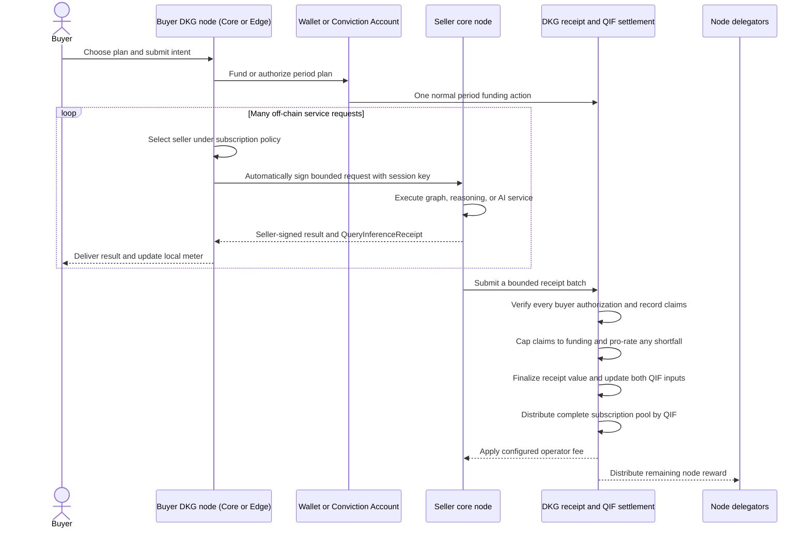
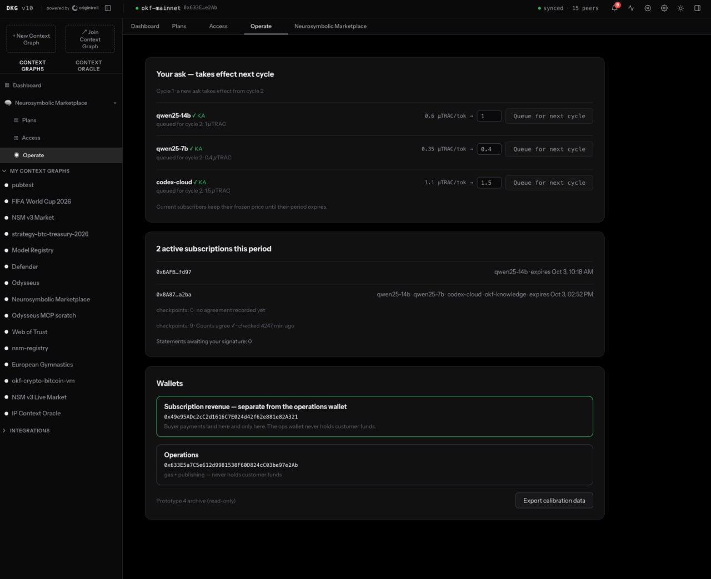
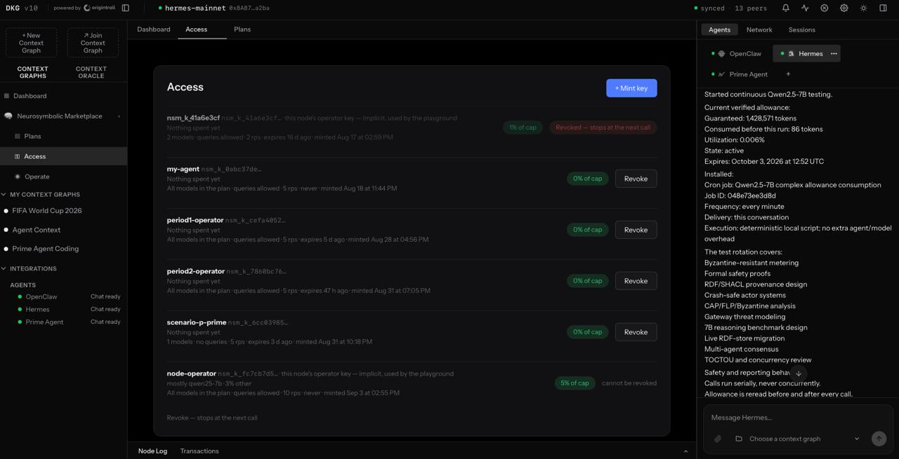

# OT-RFC-27: NeuroSymbolic Marketplace — A Marketplace for Verifiable AI and Knowledge Services

**Status:** Draft (Request for Comments)

**Date:** September 3, 2026

## Summary

OriginTrail DKG already makes TRAC the fuel for publishing and maintaining verifiable knowledge. This RFC proposes extending that utility to what happens after knowledge is published: querying it, reasoning over it, running graph ML, and invoking AI inference as native DKG services. Core and Edge Nodes gain one TRAC-funded subscription experience, while attributable Core Nodes can compete to provide the work.

Finalized value from buyer-authorized service receipts is recorded in batches and used to distribute a dedicated query/inference reward pool through the node-reward system. A protocol parameter blends each node's share of finalized receipt value with its share of stake-weighted `QueryInferenceScore`, keeping delivered service and attracted stake as distinct inputs. The result is a major expansion of what the DKG can do—from a network that publishes and preserves knowledge to a marketplace that can actively use that knowledge to deliver paid intelligence services, without requiring an on-chain transaction for every request.

## The community proposal

The foundational question is:

> Should TRAC be used not only to publish and maintain knowledge, but also to buy query, reasoning, graph-ML, and inference services on the DKG?

The proposed value flow is simple: subscription TRAC fills the query/inference reward pool; buyer-authorized and seller-claimed activity is validated and capped to funding; finalized `QueryInferenceReceiptValue` contributes directly to one distribution share and, combined with stake, to `QueryInferenceScore`; and QIF blends those two shares before the node's configured operator fee and normal delegator distribution allocate each reward.

A working prototype, summarized below, has already demonstrated this exchange end-to-end on Base mainnet, with separately operated DKG peer nodes settling real TRAC for query and inference. The question this RFC turns on is therefore not whether TRAC can pay for these services on the DKG—the prototype shows that it can—but which settlement model does so best.

The precedent is publishing: TRAC demand for a network service is recognized by the protocol and flows to the nodes that supply it. This proposal applies that principle—not publishing's per-transaction mechanism—to query and inference through a separate subscription-funded reward pool, leaving the community to compare pooled, stake-weighted settlement with other possible models.

## What the buyer experiences

A buyer starts with a familiar weekly or monthly plan. It can use a Core Node or an Edge Node. The plan can include a total period budget, allowances for particular models and knowledge services, a buyer price cap on each seller's unit ask, privacy rules, and a visible reset date. The buyer normally makes one funding transaction per subscription period from its wallet or an assigned Conviction Account and authorizes its DKG Node to spend within those policies; optional top-ups require another funding transaction, and the subscription does not lock the buyer to a particular seller. The buyer then uses one node endpoint with one or more scoped, revocable API keys and sees a meter such as:

> Qwen2.5 14B — 1.2M used · at least 3.8M remaining · resets in 12 days

The buyer does not have to find and integrate every seller separately. A Marketplace Router inside the DKG node searches signed service offers, checks current availability and unit asks, and selects sellers that fit the plan. It can choose one seller that provides a complete service or combine several specialized sellers.

A buyer might ask:

> “Find me a laptop under €1,200 with at least 16 GB of memory and a full-day battery, then compare the three best options and show where each claim comes from.”

The router could buy a graph query over current product data from one Core Node seller and a comparison and explanation service from another. The product graph and model do not need to be colocated. If one seller offers both, or if colocation improves privacy and speed, the router can prefer that option.



The single seller participant represents any eligible Core Node; a request can use one seller or compose several under the same plan. The buyer's period authorization enrolls a scoped session key without naming a seller, after which the router discovers offers and signs bounded, seller-specific requests automatically. Sellers return signed results and receipts, batch those receipts for direct validation, and earn QIF based on a tunable blend of receipt value and stake-weighted receipt value rather than a face-value per-call payment; the resulting gross node reward follows the configured operator/delegator split.

## What the prototype has already demonstrated

Successive prototype iterations ran the complete service flow on Base mainnet with real TRAC between separately operated DKG peers holding their own wallets. Buyer and seller nodes bought, served, independently metered, and reconciled both token-metered LLM inference and query-unit-metered knowledge-graph reads against on-chain settlement evidence. Swapping the buyer and seller seats between iterations showed that the same instruments settle correctly in either direction of trade.

In particular, the prototypes demonstrated:

- offers and quotes that bind an attributable seller, a service identity, a unit ask, and metering rules;
- buyer wallet connection and funded access to a chosen model or service, paid in TRAC on Base mainnet;
- both remote LLM inference (metered in tokens) and knowledge-graph reads (metered in query units), each returned with a signed service record;
- two-sided metering that reconciled to the exact unit—co-signed period statements in which the buyer's and the seller's counts matched on every offering;
- deterministic buyer-local usage recount, and rejection of settlement for an undelivered call in the tested flow; and
- on-chain funding and settlement, including exact refund reconciliation to the microTRAC under the earlier prepaid-tab design and a single on-chain TRAC payment per seller per period under the later subscription design.

The screenshots below are drawn from the current mainnet run and show the same engagement from both the seller node and the buyer node.

### Pricing offers and monitoring subscriptions (seller node)

The seller node's Operate view keeps the commercial lifecycle visible in one place. The live Base-mainnet node shown here (`okf-mainnet`, 15 peers, synced) queues per-token asks for the next cycle without repricing current subscribers, monitors active subscriptions and metering checkpoints, and keeps buyer payments in a subscription-revenue wallet that is separate from the operations wallet used for gas and publishing.



_Figure 1 — Seller node. The mainnet Operate → Neurosymbolic Marketplace view shows per-model offers with their next-cycle unit asks, the active-subscription count, and the subscription-revenue wallet kept separate from the operations wallet._

### The plan's access keys (buyer node)

On the buyer node, a funded subscription is used through metered API keys rather than raw seller endpoints. Each key is bound to the models and knowledge services in the plan, a query allowance, a rate limit, and a share of the period cap, and can be revoked at the next call. The node shown is a live Base-mainnet buyer (`hermes-mainnet`, 13 peers, synced).



_Figure 2 — Buyer node. Metered API keys against the subscription are each bound to allowed models and services, a query allowance, a rate limit, and a share of the period cap, with mint and revoke controls._

### The plan meter and count reconciliation (buyer node)

The same subscription presents as one plan meter, with a bar per offering under a shared period budget (here, "26% of this period's value used", resetting in 29 days). The offerings mix inference metered in tokens (`qwen25-14b`, `qwen25-7b`, `codex-cloud`) with a knowledge-graph read service metered in query units (`okf-knowledge`). At the foot of the period the buyer's own count and the seller's reconcile to the unit—here `our count 24,147 · provider count 24,147 ✓`—the two-sided metering the prototype section describes.


_Figure 3 — Buyer node. The per-offering plan meter shows inference metered in tokens (`qwen25-14b`, `qwen25-7b`, `codex-cloud`) alongside knowledge reads metered in query units (`okf-knowledge`), under one shared budget._

The prototype therefore validates the basic purchase, execution, signature, metering, and reconciliation components—not market pricing, economic viability, or the complete protocol proposed here. In these runs every buyer was a cooperating peer operating under a shared agreement rather than an arm's-length customer, so the evidence speaks to technical feasibility and to the network's own appetite for these services, not to external market demand or a clearing price. Its deposit-and-refund tabs, buyer post-service acknowledgement, and per-engagement settlement are being replaced by non-refundable period subscriptions, pre-service buyer authorizations, direct seller receipt batches, and QIF-based network rewards. Multi-seller discovery, the generalized Conviction Account, funded-cap pro-rata finalization, production receipt batching, and QIF distribution remain implementation and testnet work.

## The buyer's DKG Node chooses sellers from the Marketplace Context Graph

Core Node sellers publish machine-readable offers as Knowledge Assets in the Marketplace Context Graph. An offer can describe a canonical model, a graph query, reasoning rules, a graph-ML prediction, embeddings, or a complete multi-step product. It identifies the model or graph, input and output types, the seller's independent unit ask, privacy and region rules, supported transports, capacity, and expiry.

Discovery begins with the model or outcome the buyer wants. The router groups sellers that offer the same canonical model or compatible service, rejects those outside the buyer's plan and policies, asks a small set for current quotes, and selects a route. Independent seller asks therefore become competition handled by the node, not homework for the buyer.

The Core Node identity remains visible as the trust layer. A buyer can prefer known sellers, a particular Context Graph community, weights-pinned models, a region, or a better local delivery history. Receipt-backed volume shows funded authorizations and seller-claimed usage, but it is not presented as proof that results were delivered or answers were correct.

## Private inference & attested models

Marketplace offers could support an attested-execution profile for buyers who need stronger privacy and model-identity guarantees. A registered model identity would bind exact weights, tokenizer, quantization, and adapters to signed hashes. A small approved inference wrapper running inside an attested CPU/GPU trusted execution environment (TEE) would verify those hashes, keep model weights and buyer prompts protected from the host operator, and sign a result only after the bound model executes it. Buyers could then distinguish an attested model from a seller-declared one without seeing proprietary weights.

This direction is intentionally a work in progress. Runtime approval, remote-attestation registration, confidential key release, receipt binding, hardware-trust and side-channel assumptions, revocation, and a possible zero-knowledge proof or randomized-audit layer require substantial design, prototyping, security review, and benchmarking before attested execution can become a protocol requirement.

## A subscription rather than a deposit-and-refund tab

The period payment is non-refundable. Unused allowance expires at reset, remains in the network's query/inference reward pool, and is distributed as shared margin. At the cap, the buyer can wait, upgrade, or top up. Seller unit-ask changes apply only at the next plan cycle; same-cycle top-ups preserve the current ask commitments.

Each offer contains a seller-defined **unit ask**: the TRAC value advertised per token, query, or other canonical service unit. Each model or service bucket has a buyer price cap, and the router considers only sellers whose unit asks fall within it. Metered units at the accepted ask determine claimed receipt value; after authorization, funding-cap, and any pro-rata checks, finalized `QueryInferenceReceiptValue` contributes to QIF but is not paid directly to the seller. Fulfilling all advertised units remains conditional on qualifying seller capacity, while routing to a lower ask can stretch the same bucket further.

This structure keeps the normal buyer chain footprint to one subscription-funding transaction per period, excluding optional top-ups. Requests, responses, and receipts remain off-chain during service; Core sellers use separate bounded settlement transactions so the contract can verify many buyer authorizations at once and store compact replay and aggregate accounting state rather than a full on-chain record for every call.

### What if a buyer authorizes more work than it funded?

A buyer could use several sellers at once and sign valid requests whose combined maximum value exceeds its remaining subscription funds. Replay protection does not solve this, while reserving funds on-chain before every request would defeat the off-chain service path.

The proposed v1 approach combines three controls:

- **A soft ceiling:** normal service stops at 95% of a funded bucket, leaving 5% for receipts already in flight.
- **Adaptive batching:** sellers shorten batch intervals and limit unsubmitted exposure as a bucket approaches its ceiling.
- **A hard funded cap:** excess valid claims are pro-rated among only the sellers exposed to that buyer bucket, without submission-order priority.

These controls reduce ordinary races but cannot eliminate malicious parallel authorization; their parameters must be calibrated from measured gas cost, receipt lag, and over-authorization rates.

“Conviction Account” or **CA** is the proposed neutral name for what is currently publishing-specific and commonly called a PCA. The marketplace proposal extends it so an owner can assign bounded service-plan authority to an Edge Node or buyer key. The existing publishing contract does not gain that behavior merely because this document uses the shorter name; it requires an explicit migration.

## Seller receipts remove buyer withholding

The person or CA authorizes the subscription once, including its budget, eligible services, price caps, policies, and buyer-node session key. For each invocation, the router chooses a Core Node seller and signs a request naming that seller and bounding its units, accepted ask, and maximum receipt value. The seller-signed result and receipt, together with that authorization, become the settlement source of truth, so a buyer cannot receive useful work and then withhold a second signature.

The contract directly rejects objective faults such as invalid signatures, the wrong seller, inactive CA assignments, duplicates, expired authorization, ask or price-cap breaches, impossible arithmetic, and inconsistent result commitments; v1 does not depend on watchers or challenge windows.

This still leaves delivery and quality outside the contract's proof. A formally valid receipt can become a claim even if the buyer says the result never arrived, and the contract cannot cheaply decide whether an AI answer was useful. Buyers manage that remaining risk by choosing attributable Core Nodes, keeping local observations, and immediately routing away from unreliable sellers.

## From the current DKG formula to marketplace rewards

Publishing fees and subscription payments fill separate reward pools. The marketplace extension starts from the DKG write formula currently documented in [OT-RFC-26](../OT-RFC-26_Stake_Adjusted_Multi_Epoch_Node_Score_Formula/README.md), rather than treating `WriteScore` as an undefined input.

### Current DKG WriteScore

For Core Node $i$ at valid proof time $t_p$, the current DKG formula is:

```math
\mathrm{NodeScore}_i(t_p)
= S_i(t_p)\left(
    c
    + 0.86P_i(t_p)
    + 0.60A_i(t_p)P_i(t_p)
  \right)
```

where:

```math
\begin{aligned}
S_i(t)
  &= \sqrt{\dfrac{\mathrm{EffectiveStake}_i(t)}{\mathrm{STAKE\_CAP}}} \\
P_i(t)
  &= \dfrac{\sum_{e \in E_t}K_{i,e}}
           {\sum_j\sum_{e \in E_t}K_{j,e}} \\
A_i(t)
  &= 1-\dfrac{\left|\mathrm{AskVote}_i(t)-\mathrm{NetworkPrice}(t)\right|}
                 {\mathrm{NetworkPrice}(t)} \\
c
  &= 0.002.
\end{aligned}
```

Here, $S_i$ is the capped, square-root effective-stake factor, $P_i$ is the node's share of published knowledge value over the rolling multi-epoch window $E_t$, $A_i$ is alignment with the network publishing ask, and $c$ is the existing stake-baseline coefficient.

For clarity, define the expression inside the parentheses as `WriteSignal`:

```math
\mathrm{WriteSignal}_i(t_p)
= c
  + 0.86P_i(t_p)
  + 0.60A_i(t_p)P_i(t_p)
```

The current `NodeScore` produced by each valid proof is therefore the increment added to the node's accumulated `WriteScore`:

```math
\begin{aligned}
\Delta\mathrm{WriteScore}_i(p)
  &= S_i(t_p)\mathrm{WriteSignal}_i(t_p) \\
\mathrm{WriteScore}_i(e)
  &= \sum_{p \in \mathrm{ValidProofs}_i(e)}
     \Delta\mathrm{WriteScore}_i(p).
\end{aligned}
```

The write-funded part of the node reward remains unchanged:

```math
G_i^{\mathrm{write}}(e)
= B_{\mathrm{write}}(e)
  \dfrac{\mathrm{WriteScore}_i(e)}
        {\sum_j \mathrm{WriteScore}_j(e)}
```

### Query/inference extension

For query and inference, let $R_i(e)$ be Core Node $i$'s total finalized receipt value after authorization checks, the buyer's funded cap, and any pro-rata adjustment:

```math
R_i(e)
= \sum_{b \in \mathrm{AcceptedBatches}_i(e)}
  \mathrm{QueryInferenceReceiptValue}_{i,b}
```

The same finalized receipt value builds `QueryInferenceScore` using the effective-stake factor captured when each batch is accepted:

```math
\mathrm{QueryInferenceScore}_i(e)
= \sum_{b \in \mathrm{AcceptedBatches}_i(e)}
  S_i(t_b)\,
  \mathrm{QueryInferenceReceiptValue}_{i,b}
```

QIF then blends the node's normalized receipt-value share with its normalized stake-weighted receipt-value share. The protocol parameter $\lambda_{\mathrm{QIF}} \in [0,1]$ controls the relative influence of stake:

```math
\mathrm{QIF}_i(e)
= (1-\lambda_{\mathrm{QIF}})
  \dfrac{R_i(e)}{\sum_j R_j(e)}
+ \lambda_{\mathrm{QIF}}
  \dfrac{\mathrm{QueryInferenceScore}_i(e)}
        {\sum_j \mathrm{QueryInferenceScore}_j(e)}
```

At one endpoint, query/inference distribution follows finalized receipt value alone; at the other, it follows fully stake-weighted receipt value. This RFC does not prescribe a value for $\lambda_{\mathrm{QIF}}$; it is to be calibrated through economic simulation, testnet observation, and community review. The existing write formula remains unchanged.

### Expanded node reward

Let $B_{\mathrm{write}}$ be the publishing-funded pool and $B_{\mathrm{queryInference}}$ be the subscription-funded pool, including unused allowance, reserve, top-ups, and upgrades. The marketplace expands the current node reward with a second, source-separated term:

```math
\mathrm{NodeReward}_i(e)
= B_{\mathrm{write}}(e)
  \dfrac{\mathrm{WriteScore}_i(e)}
        {\sum_j \mathrm{WriteScore}_j(e)}
+ B_{\mathrm{queryInference}}(e)
  \mathrm{QIF}_i(e)
```

| Reward source | Activity input | Stake-aware accumulator | Normalized distribution |
| --- | --- | --- | --- |
| Publishing | `WriteSignal` from valid proofs | `WriteScore` | `WriteScore` share |
| Query/inference | Finalized receipt value $R_i$ | `QueryInferenceScore` | Parameterized QIF blend |

Both pools are fully distributed, but QIF cannot claim write-funded value. Every subscription token enters the query/inference pool whether or not the buyer consumes its full allowance; a funded period with no finalized receipt value rolls forward to the next active period. Because QIF is a network reward factor rather than reimbursement, a seller can receive more or less than its own receipt value, with the stake-related difference controlled by $\lambda_{\mathrm{QIF}}$.

## What is in it for the Core Node operator?

The buyer payment enters the network query/inference pool rather than going directly to the seller. QIF's parameterized blend of receipt value and stake-weighted `QueryInferenceScore` determines the Core Node's gross share, after which the node's configured operator fee goes to the operator and the remainder follows the normal delegator distribution.

Let $G_i^{\mathrm{queryInference}}$ be Core Node $i$'s query/inference-funded gross reward and $f_i$ its operator-fee fraction:

```math
G_i^{\mathrm{queryInference}}
= B_{\mathrm{queryInference}}
  \mathrm{QIF}_i
```

For example, a 20% share of a 5,000 TRAC pool produces a 1,000 TRAC gross node reward; with a 10% operator fee, 100 TRAC goes to the operator and 900 TRAC to the delegator reward pool. Attracting stake can increase future QIF, while raising the operator fee can reduce delegator returns and drive stake away. The operator should serve only when expected fee revenue covers compute, power, bandwidth, maintenance, availability, and evidence-submission costs:

```math
\mathrm{E}[f_i \cdot G_i^{\mathrm{queryInference}}]
> \mathrm{E}[C_i^{\mathrm{serve}}]
```

Higher-cost services may therefore need a higher unit ask, operator fee, volume, or some combination; the proposal reuses the node-wide fee split, while connecting query-pool share to gross rewards still requires protocol implementation.

## The outcome

For buyers on Core or Edge Nodes, this is one plan, one node endpoint, scoped keys, and one meter across many graph and AI sellers. For Core Node operators, it turns seller-signed, buyer-authorized service activity and attracted stake into a share of gross node rewards and therefore operator-fee revenue, while delegators share the remainder. For the network, it connects publishing, querying, reasoning, graph ML, and inference without a blockchain transaction for every interaction.

The technical data structures, Core and Edge Node roles, CA assignment, subscription and metering rules, direct receipt-batch validation, cross-seller over-authorization controls, transport envelopes, reward bounds, rollout gates, and complete sequence diagrams are works in progress that will be refined through further design, implementation, testing, and community review.

## Feedback collection point

Please provide comments to the RFC on this Github issue: https://github.com/OriginTrail/OT-RFC-repository/issues/64
